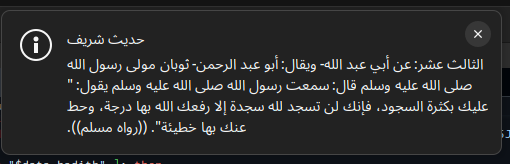
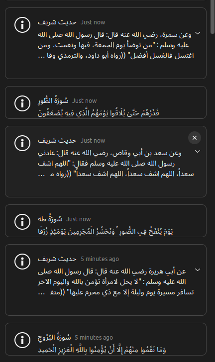

## islam-notification-linux

Simple script to show random verses and hadith from the holy quran by consuming [alquran API](https://alquran.cloud/api) and piping that notify-send


### Quran


### Hadith



<!-- ### Notifications List
 -->


## Installation

save the script `islam-notification-linux` to your $PATH e.g in `~/.local/bin/islam-notification-linux` and give it permissions to execute `chmod +x ~/.local/bin/islam-notification-linux`

## Hooking it into cron

You can install it also as a cron job to run periodically e.g `crontab -e` and then add this entry

```bash
*/15 * * * * /home/xmonader/wspace/islam-notification-linux/islam-notification-linux
```

the above cron entry runs every 15mins, please make sure to replace the command path to where downloaded it on your filesystem.

## Expandable notifications

To see the verses in the fullsize notification modal, please try installing [Expandable notifications extensionn](https://extensions.gnome.org/extension/4463/expandable-notifications/)

## Credits

- <https://github.com/HussamAdil/Ayat>
- <https://github.com/SABER-MOHAMED/Hadith>
